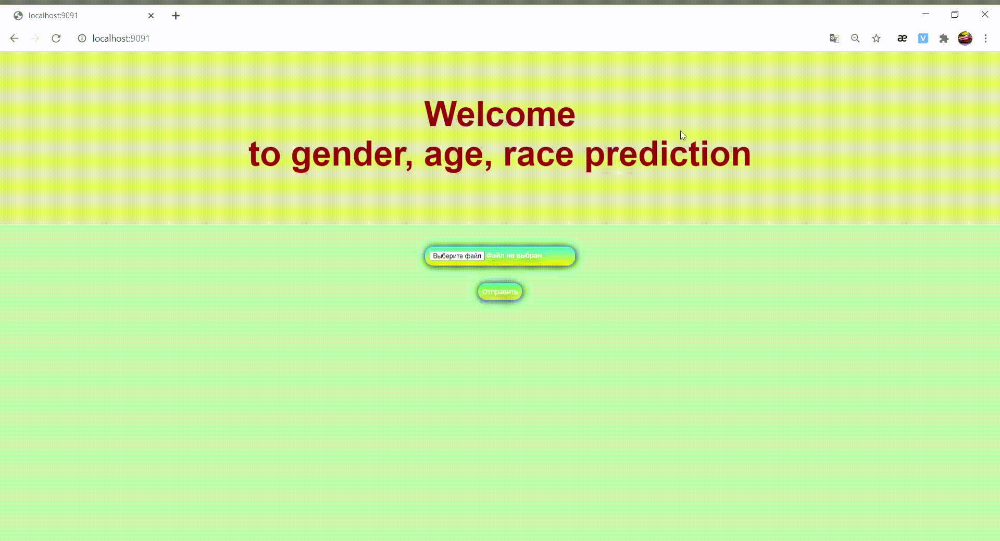
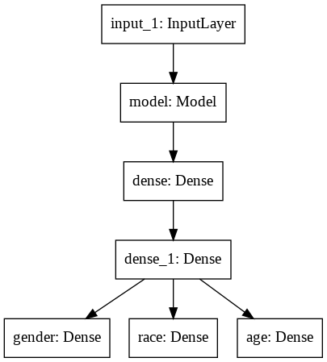

# GAR (Gender, Age, Race) predict

## Что это такое и что оно умеет?
Это простое flask-приложение с веб-интерфейсом и возможностю запуска внутри docker-контейнера.
Приложение умеет по фотографии определяет пол, возраст и расу человека или людей на ней находящихся. 

Под капотом - OpenCV face recognition + resnet50 c 3 обученными головами под multitask learning 
(бинарная, многоклассовая классификация, регрессия).

Подробнее об обучении можно узнать в ноутбуке **train_mt_model.ipynb**

## Подводные камни и недостатки:
1. Довольно примитивный веб-интерфейс.
2. Плохо определяет возраст, просьба не серьчать.
3. Приложение после загрузки, по какой-то причине, не может декодировать некоторые фотки, и всё падает с соответствующей 
   ошибкой (это я постараюсь отдебажить).

## Как запустить? (How to start?)
### Build container
`docker build -t <<name_image>>:v1 .`

### Run container
`docker run --name <<container_name>> -p 9091:9091 <<name_image>>:v1`

### Open in browser
`localhost:9091`